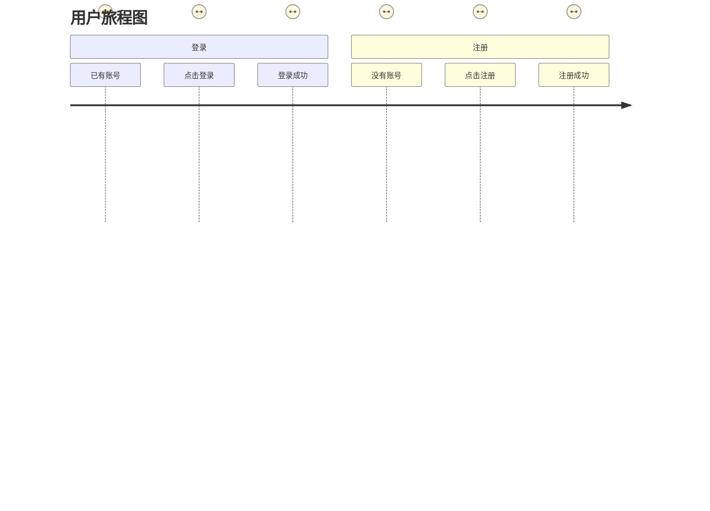
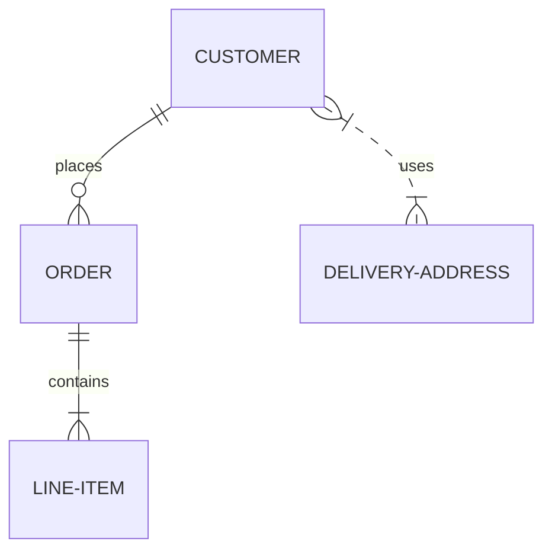
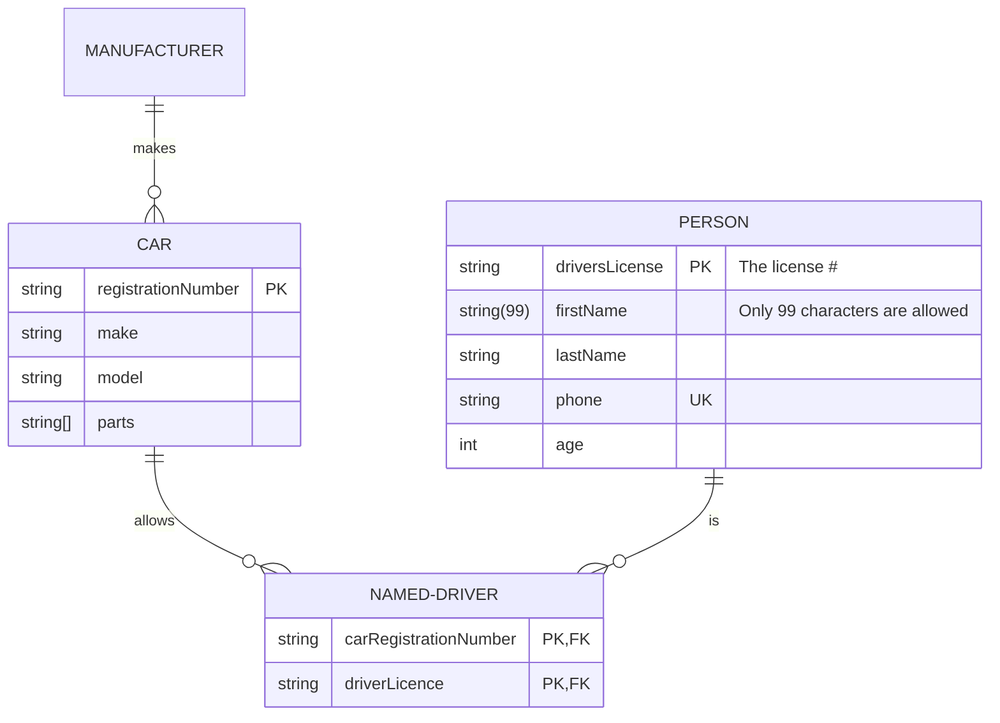
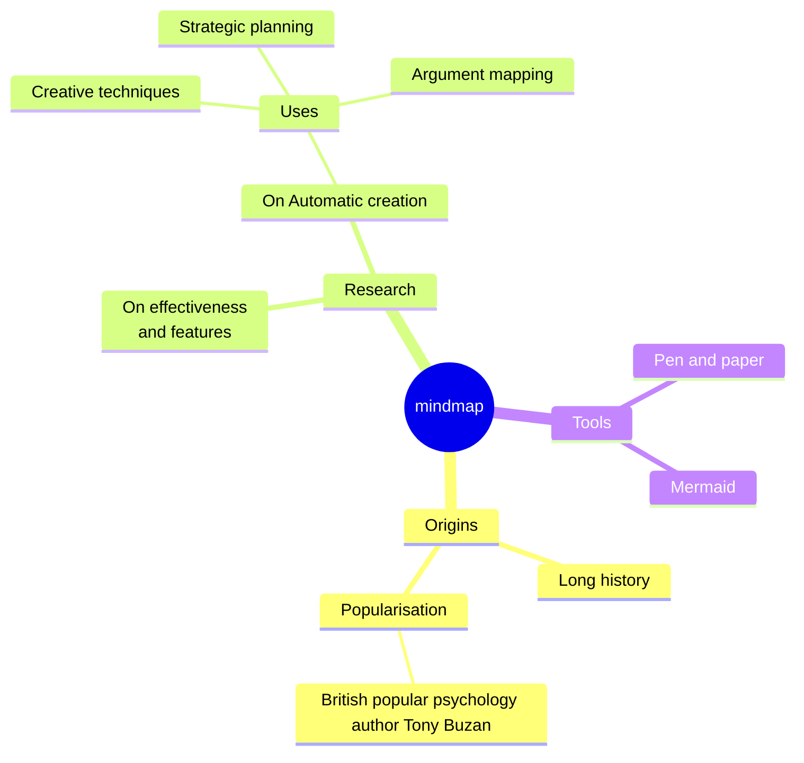
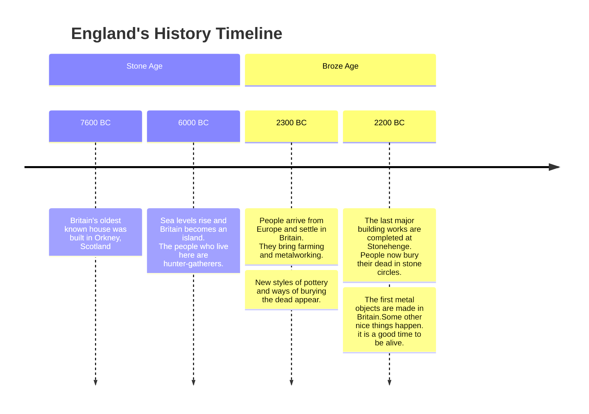
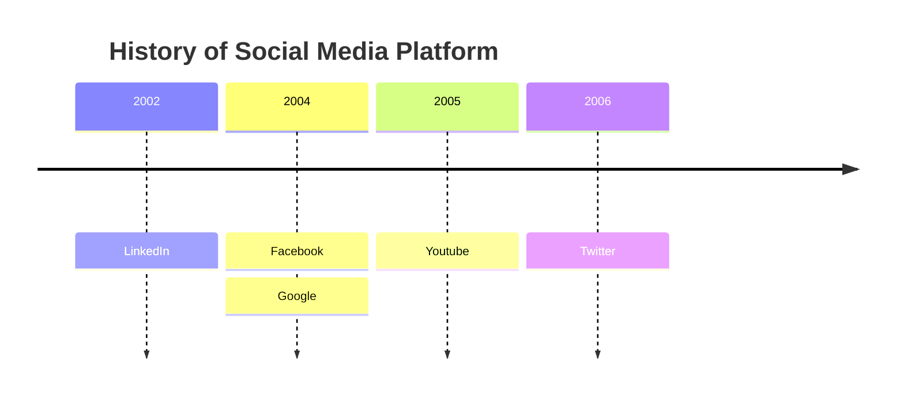

# Hello-World

```mermaid
journey
title 用户旅程图
section 登录
已有账号         : 已有账号页面
点击登录         : 登录操作
登录成功         : 登录成功页面
section 注册
没有账号         : 注册页面
点击注册         : 注册操作
注册成功         : 注册成功页面
```

```mermaid
erDiagram
    CUSTOMER ||--o{ ORDER : places
    ORDER ||--|{ LINE-ITEM : contains
    CUSTOMER }|..|{ DELIVERY-ADDRESS : uses
```

```mermaid
erDiagram
    CAR ||--o{ NAMED-DRIVER : allows
    CAR {
        string registrationNumber PK
        string make
        string model
        string[] parts
    }
    PERSON ||--o{ NAMED-DRIVER : is
    PERSON {
        string driversLicense PK "The license #"
        string(99) firstName "Only 99 characters are allowed"
        string lastName
        string phone UK
        int age
    }
    NAMED-DRIVER {
        string carRegistrationNumber PK, FK
        string driverLicence PK, FK
    }
    MANUFACTURER only one to zero or more CAR : makes
```

```mermaid
mindmap
  root((mindmap))
    Origins
      Long history
      ::icon(fa fa-book)
      Popularisation
        British popular psychology author Tony Buzan
    Research
      On effectiveness<br/>and features
      On Automatic creation
        Uses
            Creative techniques
            Strategic planning
            Argument mapping
    Tools
      Pen and paper
      Mermaid
```

```mermaid
timeline
        title England's History Timeline
        section Stone Age
          7600 BC : Britain's oldest known house was built in Orkney, Scotland
          6000 BC : Sea levels rise and Britain becomes an island.<br> The people who live here are hunter-gatherers.
        section Broze Age
          2300 BC : People arrive from Europe and settle in Britain. <br>They bring farming and metalworking.
                  : New styles of pottery and ways of burying the dead appear.
          2200 BC : The last major building works are completed at Stonehenge.<br> People now bury their dead in stone circles.
                  : The first metal objects are made in Britain.Some other nice things happen. it is a good time to be alive.
```

```mermaid
timeline
    title History of Social Media Platform
    2002 : LinkedIn
    2004 : Facebook : Google
    2005 : Youtube
    2006 : Twitter
```
